<p align="center">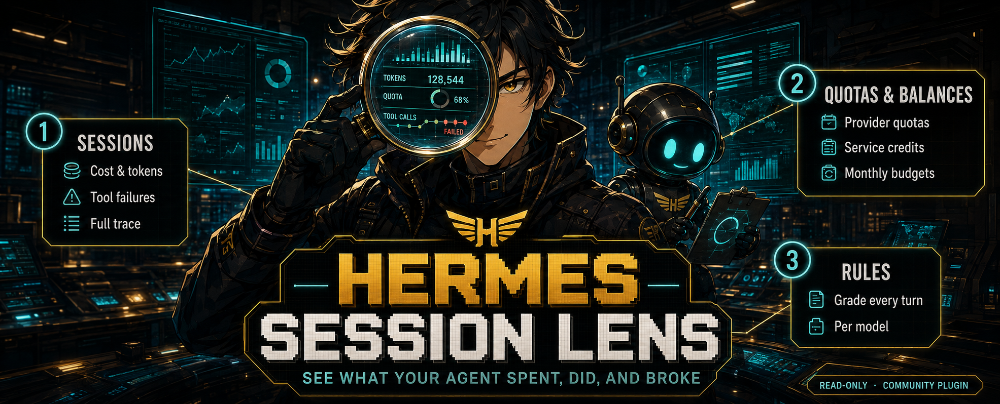</p>

# Hermes Session Lens

**See what your Hermes agent spent, did, and broke.** Session Lens is a read-only observability page inside Hermes Desktop. It shows what every session consumed and did, the live allowances and balances of the AI providers and services Hermes holds credentials for, how well each model follows the instructions you give your agent, and the runtime health, profiles, and schedules behind all of it — grounded in Hermes' own records, never in guesses.

It installs as one Hermes plugin: a native Desktop page plus its namespaced Python API. No iframe, no separate server, no telemetry service, and no write path — the backend defines zero mutation routes and never touches a credential store.

This documentation describes Hermes Session Lens `0.33.1`, verified on Hermes Agent and Desktop `0.21.0`. MIT licensed. A community plugin, not affiliated with or endorsed by Nous Research.

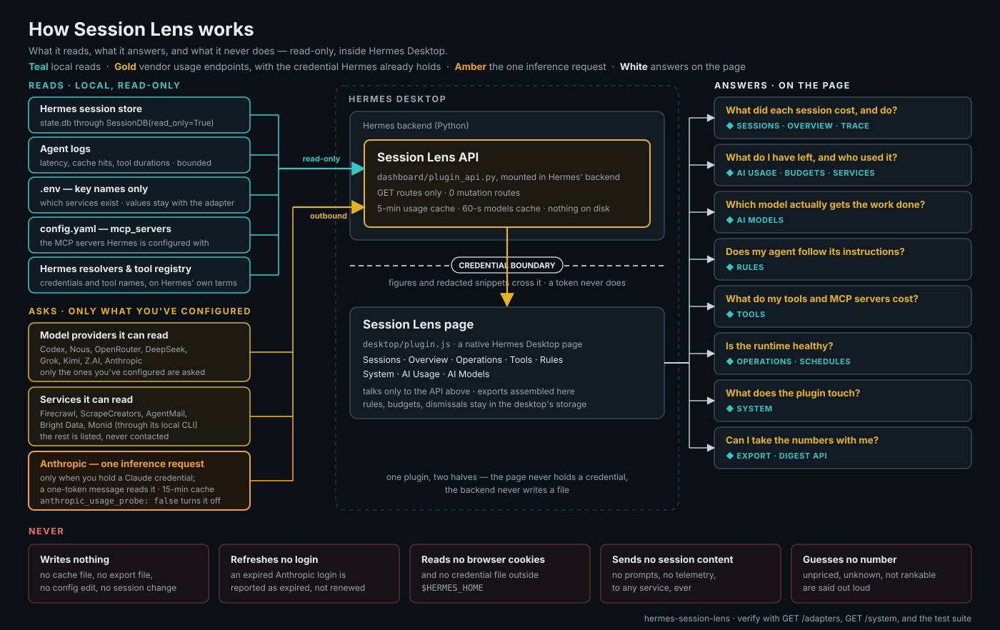

Left to right: what the plugin reads (local records, read-only, plus the vendor usage endpoints it can ask — only for credentials you have configured), the plugin itself (a GET-only API inside Hermes' backend and a native Desktop page, separated by a boundary no credential crosses), and the eight questions the page answers. The strip along the bottom is what it never does; the [Trust](#trust) section states each claim in full and how to verify it.

## Install

From a local checkout:

1. Place this repository at `$HERMES_HOME/plugins/session-lens`.
2. Enable its backend:

   ```text
   hermes plugins enable session-lens
   ```

3. Restart Hermes Desktop so its embedded backend mounts `dashboard/plugin_api.py`. **Session Lens** appears in the left sidebar.

Or use Hermes' confirmation-based install link — Hermes shows the source and components before installing anything:

```text
hermes://plugin/install?repo=abualnassr/hermes-session-lens&enable=1
```

Hermes Agent updates never remove the plugin, because it lives under `$HERMES_HOME/plugins/`, outside the Hermes source checkout. To update Session Lens, replace that folder with a newer release and restart Hermes Desktop. During development, **Reload desktop plugins** from the command palette picks up `desktop/plugin.js` changes; backend changes still need a restart. The Desktop half can be switched off live under **Settings → Plugins**.

Hermes plugins and telemetry are per-profile. The header chip ("data: default profile") always names the profile whose records you are looking at, and its popover widens the scope to any set of profiles.

## What you get

Every view honours the same period selector (7/30/90 days, all time, or a custom range) and the same profile scope. Numbers carry their denominators, samples that are too small render as fractions rather than percentages, and anything Session Lens cannot know — an unpriced route, a window without a span, a failure in a language its signatures do not read — says so instead of showing a comforting zero.

### Sessions — failure-first, with the full trace

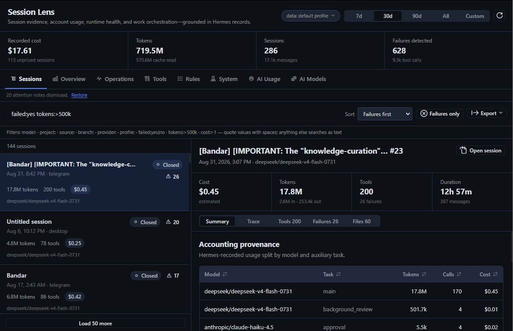

Every recorded session, sorted failures-first by default. The search box takes free text or filters — `model:opus project:deepcore failed:yes tokens:>500k cost:>1` — and full-text search returns the matching snippets. A session opens beside the list with its cost provenance (recorded actual or estimated cost, or an explicit **Included** / **Unpriced** state — never a false `$0`), token mix per model and auxiliary task, every tool call, every confirmed failure with a bounded, secret-redacted result snippet, the files it touched, and the sessions it delegated to.

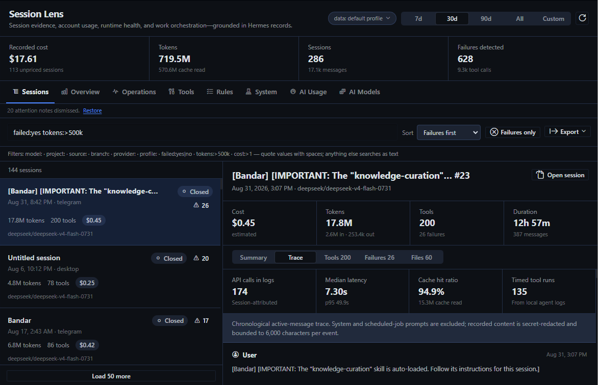

The **Trace** tab replays the session in order — user, assistant, reasoning, tool call, tool result — with system prompts excluded and content redacted and bounded. Latency, cache-hit ratio, and tool durations come from Hermes' local agent logs. An attention banner above the list flags runaway work (sessions open past 24 hours that are still active or idle on five million tokens, and reaped or timed-out sessions at the same size); each note can be dismissed and restored.

### Overview — where the spend goes

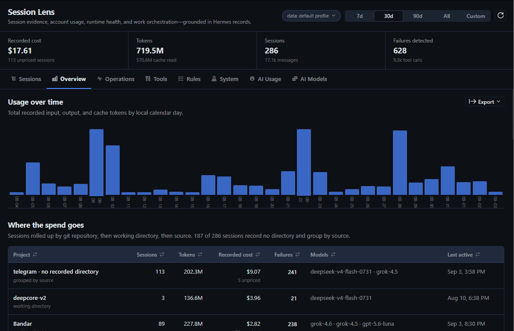

Tokens by day, then the spend rolled up by git repository, working directory, or source for sessions that recorded no directory: sessions, tokens, recorded cost with unpriced counts, confirmed failures, top models, last activity. Every row drills through to the filtered session list.

### AI Usage — what you have left, and who used it

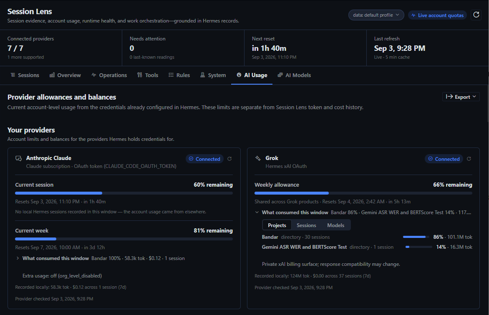

Live account-level allowances and balances for the providers Hermes already holds credentials for: OpenAI Codex, Anthropic Claude, Nous Research Portal, OpenRouter, DeepSeek, Grok, Kimi Code Plan, and Z.AI GLM Coding Plan. Each window shows what remains, when it resets, and — when it is burning faster than the period elapses — when it will run out at the current pace. **What consumed this window** joins Hermes' own usage records to the window's span and ranks the projects, sessions, and models behind it; money windows state how much of the account figure local sessions explain, and that the rest came from other machines or tools.

Anthropic gets one card per product Hermes holds a credential for: the Claude subscription (5-hour and 7-day windows, extra-usage state) and the Console API key (per-minute request and token limits). Because Anthropic's usage endpoint only answers full OAuth logins, those cards are read from the response headers of a one-token message — the single inference request Session Lens makes, described in full under [Trust](#trust).

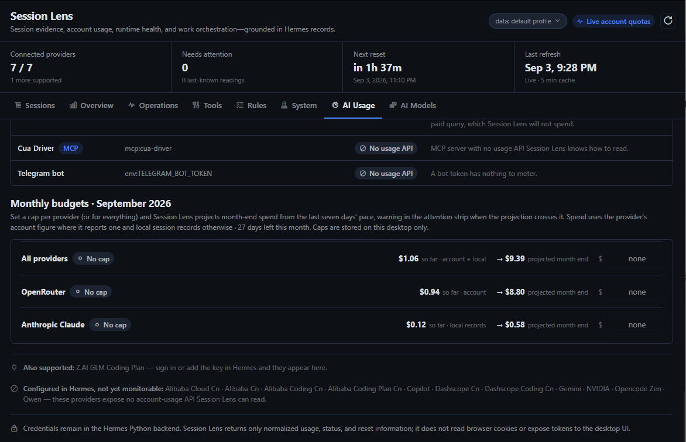

**Monthly budgets** take a USD cap per provider or for everything, and project month-end spend from the last seven days' pace using the provider's own account figure where it reports one and local session records otherwise. Over-cap and on-pace-to-exceed budgets join the quota notes in the attention strip on every tab. Caps live in the desktop's plugin storage; the backend stores nothing.

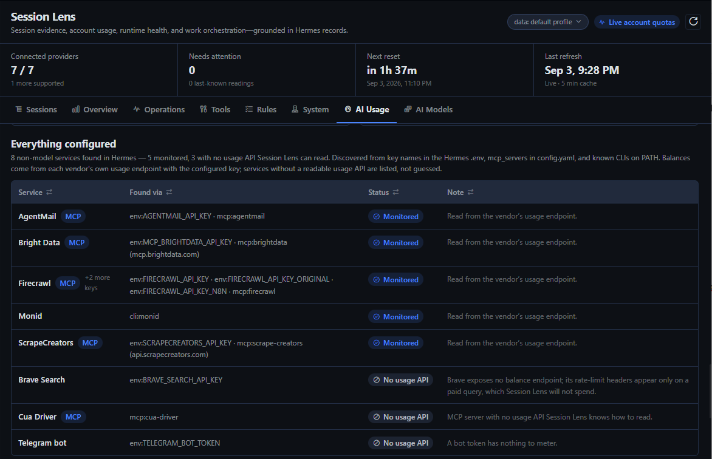

**Services** inventories every non-model service Hermes is configured with — from key *names* in the profile's `.env`, `mcp_servers` in `config.yaml`, and known CLIs on PATH, never from skill folders or credential files elsewhere — and shows the balance for those whose usage endpoint was verified against the live API (Firecrawl, ScrapeCreators, AgentMail, Bright Data, Monid). Services with no readable usage API are listed with the reason, not guessed.

### AI Models — a verdict per model from two kinds of evidence

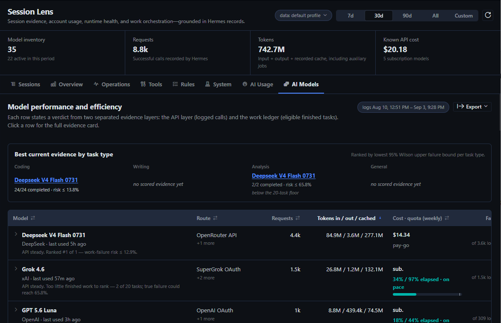

An automatic inventory of every model Hermes has ever recorded, with the selected period's requests, token mix, cost or quota burn, fail rate, retry/switch sessions, work evidence, latency, and trend. Each row leads with a one-sentence verdict that fuses two separate layers: the **API layer** (what the bounded local logs say about errors, rate limits, timeouts, and latency) and the **work ledger** (what recorded sessions say about tasks actually completed). A task counts as finished when its session completed or was closed by a Desktop reset or restart with no failure end reason; the bounded logs then decide whether it was clean, recovered, or abandoned on an API failure. Models rank by the lowest 95%-confidence upper bound on their failure rate (a Wilson score) once they clear a configurable sample floor; below it they show plain fractions and a "not rankable yet" banner rather than any percentage, and every excluded task states why.

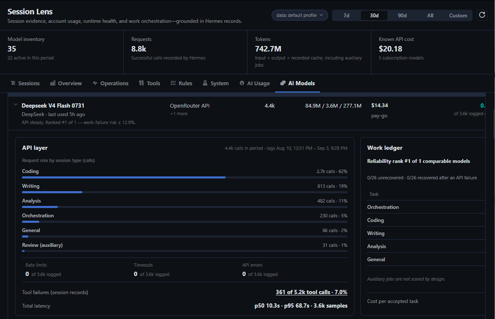

Expanding a row opens the full evidence card. The scoring rules — how a session gets its task type, what counts as completed, clean, or recovered, and what can never improve a rate — are written down in [DESIGN.md](DESIGN.md#ai-models).

### Tools — every tool and MCP server, priced

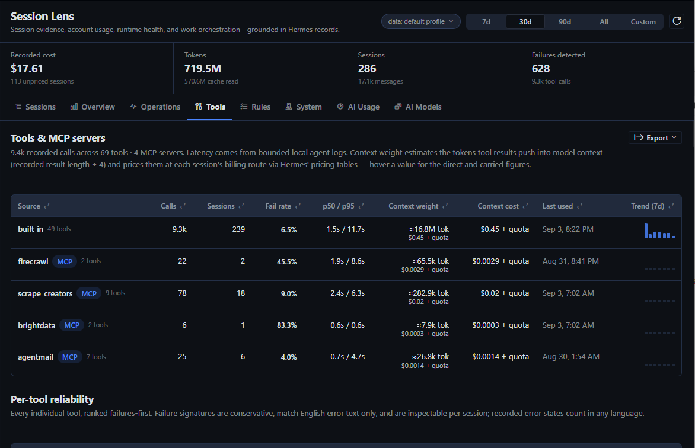

Call volume, sessions, fail rate, p50/p95 latency, and last use for every tool and every MCP server, then per-tool reliability ranked failures-first with a dedicated failed-call inspector. **Context weight** estimates the tokens each tool's results push into model context (recorded result length ÷ 4) and prices them at each session's billing route through Hermes' own pricing tables — direct entry at the input rate plus a carried upper bound for re-sends, "quota" on subscription routes, "unpriced" where Hermes has no rate. Explicit skill invocations are counted from recorded `skill_view` / `skill_manage` calls; available skills are never mislabelled as used.

### Rules — grade your agent against its own instructions

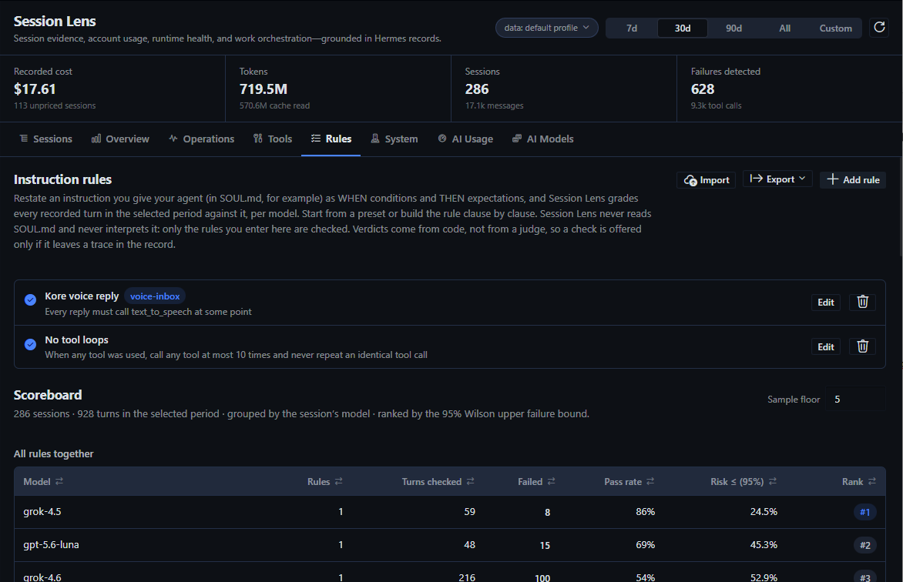

Restate an instruction you give your agent as WHEN conditions and THEN expectations, and Session Lens grades every recorded turn in the period against it, per model. Twelve presets cover the common sentences (every reply must call a tool, no tool loops, cite when searching, never run a destructive command, reply in the user's language, …); the builder composes any rule from a catalog of conditions and expectations, each clause negatable, with tool fields fed by Hermes' live tool registry and every name the records have seen.

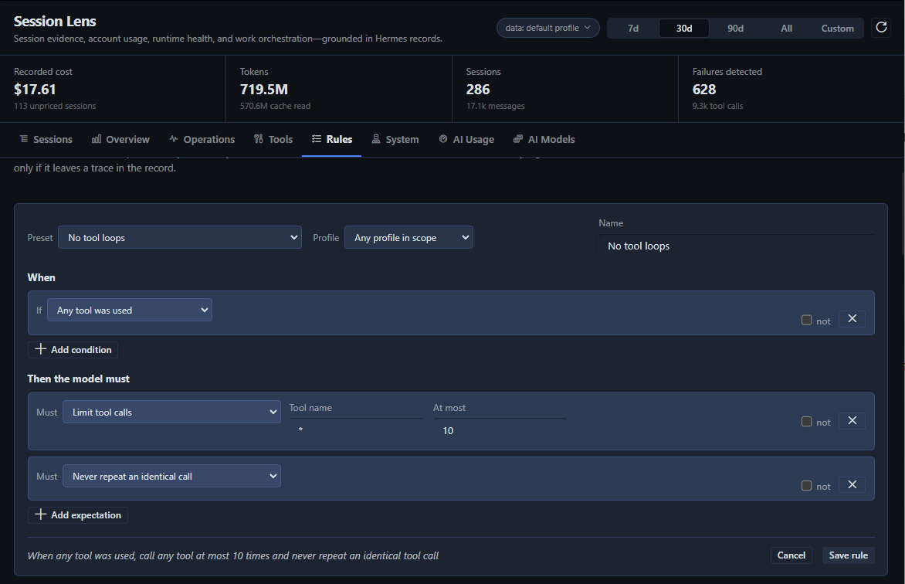

Verdicts are pass, fail, or not applicable; every failure links to the turn; scores rank by the 95% Wilson upper failure bound above a sample floor. Verdicts come from code, not from a model: nothing reads SOUL.md, nothing judges tone, and a check is offered only if it leaves a trace in the record. Rules export and import as JSON.

### Operations and System

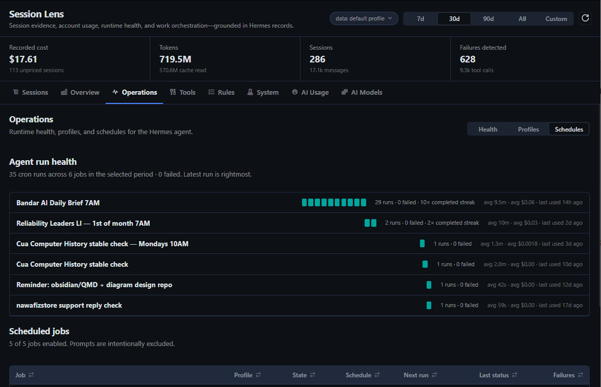

**Operations** covers gateway and platform health for every profile, context-compression distress (fallback streaks, ineffective passes, cooldowns), profiles, and schedules — with an agent run-health scoreboard per cron job: latest runs, failures, streaks, average duration and cost, and click-through to the runs. Schedule prompts are never returned.

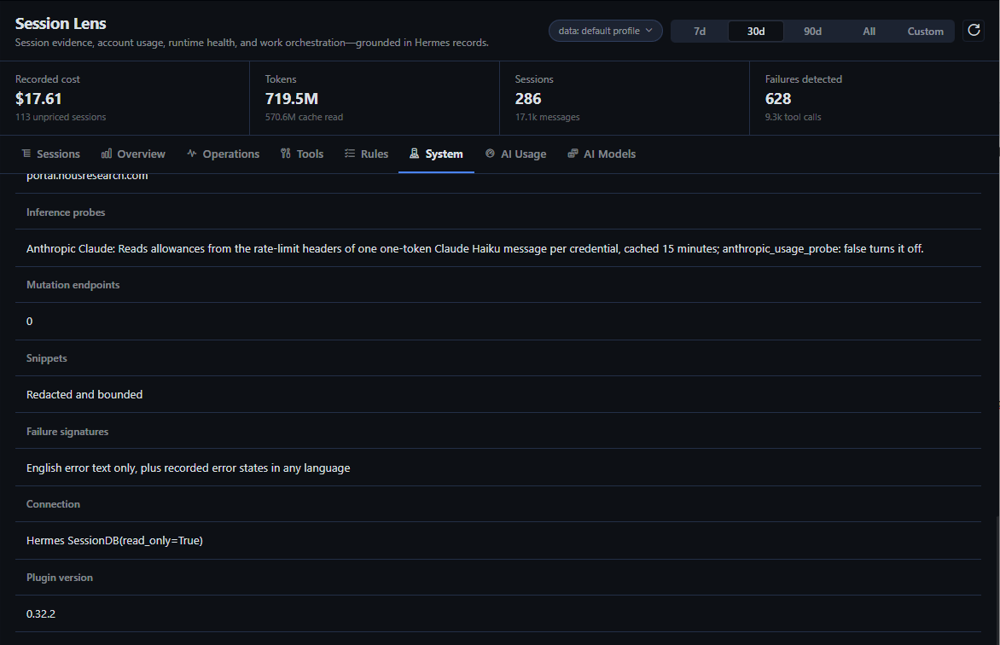

**System** states the plugin's posture at runtime: database connection and schema, the external hosts the backend can contact, the one inference probe it sends, mutation endpoints (zero), redaction, the language limit of its failure signatures, and the plugin version — so compatibility and trust claims are visible after every update.

### Export, anywhere

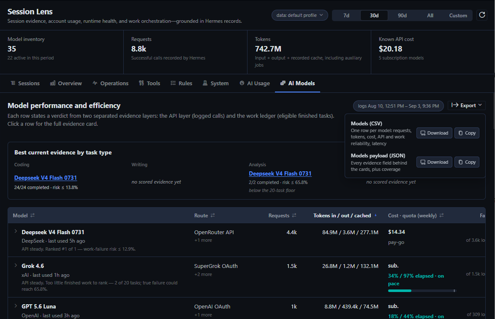

Every data view exports what it shows as CSV (tables), JSON (the full payload behind the tab), or a Markdown digest for the period, as a download through the desktop's Save File dialog or a copy to the clipboard. Exports are assembled in the desktop from the same read-only routes; the backend gains no export route and writes no file.

## The API and the digest

Everything the page shows comes from `GET /api/plugins/session-lens/…` routes inside Hermes' own backend, so any local automation that can call the Hermes API can read them. The one built for that purpose is the digest:

```text
GET /api/plugins/session-lens/digest?days=7&budgets=openrouter:150,all:300
```

It returns period totals with prior-period deltas, the attention list, monthly spend per provider with projections and cap status, top models with work-reliability evidence, quota windows with pace, exhaustion forecasts and attribution, money windows with how much local sessions explain, service balances, instruction-rule scores when rules are passed, and a ready-made `markdown` field — for cron agents, notification pipelines, or a Hermes agent that reads its own telemetry. `GET /adapters` publishes the vendor registry credential-free, and `GET /system` the privacy posture.

## Settings

Everything optional lives under the plugin's namespaced Hermes configuration:

```yaml
plugins:
  entries:
    session-lens:
      settings:
        rate_sample_threshold: 20
        model_route_mappings:
          "gpt-5.6-*": "OpenAI OAuth"
        anthropic_usage_probe: true
```

`rate_sample_threshold` is the sample floor before fail and retry/switch rates rank and colour (default 20). `model_route_mappings` are model-id globs that override the route label Session Lens infers from a model's recorded history. `anthropic_usage_probe` controls the one request Session Lens makes that is not a usage or balance endpoint (see [Trust](#trust)); set it to `false` to stop the one-token Claude message — the Anthropic card then reads only logins that answer the account-usage endpoint, and a setup token or API key shows "Not configured" with the reason.

## Trust

Session Lens is meant to be inspected, not trusted on its word. This is what the backend can and cannot do, and how to check each claim from the code.

**What it reads.** Hermes' session store through `SessionDB(read_only=True)` (dormant profile stores in SQLite immutable mode when no WAL exists), the profile's agent logs, key *names* from the profile's `.env` (never values, except inside an adapter that needs the key for its own request), `mcp_servers` from `config.yaml`, Hermes' own credential resolvers for the provider adapters, and Hermes' tool registry for the tool-name directory. It never opens skill folders, browser profiles or cookies, or credential files outside `$HERMES_HOME`.

**What it writes.** Nothing. There is no mutation route (`/system` reports `mutation_endpoints: 0`), no cache file, no export file — CSV, JSON, and Markdown exports are assembled in the desktop from the read-only routes, and rules, budgets, and dismissals live in the desktop's plugin storage and travel as query parameters. Runtime logs and AI Models classification use bounded in-memory caching only. Session Lens itself never rotates or rewrites a Hermes login. Two adapters ask Hermes' own credential resolvers for a current token (OpenAI Codex through Hermes' account-usage module, Grok through Hermes' xAI resolver), and Hermes may refresh an expiring OAuth token through its normal path when asked; the Anthropic adapter deliberately does not, and an expired Anthropic login is reported as expired.

**What it contacts.** Only the hosts below, each with the credential Hermes already holds for that vendor, and only for the vendor's own usage or balance endpoint — with one exception, stated in full in the next paragraph. Every host is declared by its adapter module, published credential-free by `GET /adapters`, shown on the System tab under "External hosts", and this table is checked by the test suite against the registry:

| Adapter | Host | How |
| --- | --- | --- |
| OpenAI Codex | `chatgpt.com` | Hermes' own account-usage code with the Hermes Codex OAuth login |
| Anthropic Claude | `api.anthropic.com` | the account-usage endpoint for full OAuth logins; otherwise a one-token message whose response headers carry the allowance (see below) |
| Nous Research Portal | `portal.nousresearch.com` | Hermes' own portal client with the Hermes Nous login |
| OpenRouter | `openrouter.ai` | Hermes OpenRouter API key |
| DeepSeek | `api.deepseek.com` | Hermes DeepSeek API key |
| Grok | `cli-chat-proxy.grok.com` | Hermes xAI OAuth credentials |
| Kimi Code Plan | `api.kimi.com` | Hermes Kimi API key |
| Z.AI GLM Coding Plan | `api.z.ai` | Hermes Z.AI API key |
| Firecrawl | `api.firecrawl.dev` | `FIRECRAWL_API_KEY` from the Hermes `.env` (cloud only; a self-hosted URL is never called) |
| ScrapeCreators | `api.scrapecreators.com` | `SCRAPECREATORS_API_KEY` from the Hermes `.env` |
| AgentMail | `api.agentmail.to` | `AGENTMAIL_API_KEY` from the Hermes `.env` |
| Bright Data | `api.brightdata.com` | `BRIGHTDATA_API_KEY` (or the MCP key) from the Hermes `.env` |
| Monid | none directly | the local `monid` CLI, which talks to Monid itself |

No request is made for a provider whose local credential probe shows nothing configured, no request carries session content, prompts, or telemetry, and nothing is sent to any analytics or telemetry service. Provider checks never read browser cookies, and usage checks accept a credential only when Hermes resolves it for the official provider host. Brave Search, Telegram, here.now, and unknown keys or MCP servers are inventoried by name and never contacted.

**The one inference request: the Anthropic probe.** Anthropic's account-usage endpoint answers only OAuth logins that carry the `user:profile` scope. A Claude setup token (`CLAUDE_CODE_OAUTH_TOKEN` / `ANTHROPIC_TOKEN`) carries `user:inference` alone and an API key is not OAuth at all, so for those credentials the only readable source is the `anthropic-ratelimit-*` headers Anthropic attaches to every message response. Session Lens therefore sends one message to Claude Haiku — the single character `.`, `max_tokens: 1`, no session content — per Anthropic credential, reads the headers, and discards the reply. For a subscription token that yields the 5-hour and 7-day allowance and whether extra usage is on; for a Console API key it yields the per-minute request and token limits, and each becomes its own card. The cost is one request against the subscription window or a fraction of a cent on the key, and the call appears in the Anthropic Console request log. Every outcome is cached for 15 minutes per credential (a manual refresh re-probes), a full login is tried against the usage endpoint first and probed only if that fails, the adapter is registered with `request_kind: inference_probe` so `GET /adapters` and the System tab ("Inference probes") name it, and `anthropic_usage_probe: false` in the plugin settings turns it off. Subscription tokens are sent with the same Claude Code identity headers Hermes itself uses for its OAuth inference; API keys are sent plain. Nothing is refreshed, rotated, or written.

**What reaches the desktop.** Normalized usage figures, redacted and length-bounded snippets, and never a credential (`/system` reports `provider_credentials_returned_to_desktop: false`). Tool results, transcript events, schedule errors, and gateway errors are secret-redacted and length-bounded before they leave the backend. System prompts and schedule prompts are never returned.

**Where the limits are.** Failure detection combines Hermes' authoritative finish and effect states with conservative text signatures in tool results; SQL only finds candidates, and the Python signature confirms the content before any metric counts it. **The text signatures are English-only.** They match words such as `error`, `failed`, `traceback`, `permission denied`, `timed out`, and non-zero exit codes; a tool that reports its failure in another language is counted only when Hermes recorded an error state, so failure rates on Tools, Sessions, and AI Models are a floor, not a ceiling, for non-English output. The System tab states this limit and `/system` carries it as `failure_signatures_language`. Quota attribution explains only what local records can explain and says so. Cost is recorded actual or estimated cost, or an explicit unpriced state, never a guess. File paths are observed evidence, not an audit of every filesystem operation. Rules are deterministic checks over recorded turns; nothing reads SOUL.md and no model judges anything.

**How to verify.** `grep -rn "https://" dashboard/` finds every vendor URL in the backend, and each one lives in an adapter module under `dashboard/_providers/` or `dashboard/_services/` (the only other hit is a URL-prefix check in `_common.py`). `GET /adapters` lists the registry at runtime. `python -m unittest discover -s tests` runs the checks that keep this section, the System tab, and the registry in agreement.

## Compatibility

Verified on 2026-09-03 with:

- Hermes Agent `0.21.0` (Hermes Desktop `0.21.0`, commit `0cbc6e3`)
- Hermes state schema `28`
- Hermes Desktop Plugin SDK from the 2026-08-19 release
- Windows 11

The first release was verified on Hermes Agent `0.20.5` with state schema `26`, and every release since has been checked against the Hermes build installed at the time. The plugin uses Hermes' public Desktop SDK and `SessionDB(read_only=True)`; the System view shows the active schema and data source so compatibility is visible after an update.

## Development

The Desktop entry is uncompiled ESM. It may import only `@hermes/plugin-sdk`, `react`, and `react/jsx-runtime`, and must use `jsx()`/`jsxs()` rather than JSX syntax.

Provider and service adapters are one module each under `dashboard/_providers/` and `dashboard/_services/`; the packages import every module they contain, and each module registers itself with `register_provider(...)` or `register_service(...)`. [ADAPTERS.md](ADAPTERS.md) is the recipe, including the rule that an adapter is added only after its usage endpoint was verified against the live API. [DESIGN.md](DESIGN.md) records the visual system and the scoring rules; [PRODUCT.md](PRODUCT.md) the product commitments.

Run the tests with the Python environment used by Hermes:

```text
python -m unittest discover -s tests -v
node --input-type=module --check < desktop/plugin.js   # plain `node --check` skips .js files that contain `import`
```

## Credits and license

Hermes Session Lens is MIT licensed. See [UPSTREAM.md](UPSTREAM.md) and [THIRD_PARTY_NOTICES.md](THIRD_PARTY_NOTICES.md) for transparent credit to TokenTelemetry, Hermes Session Analyzer, Hermes Agent, and the projects whose response-shape and behaviour references informed the provider adapters. No upstream logo is reused, and nothing here implies endorsement by any upstream author or by Nous Research.
